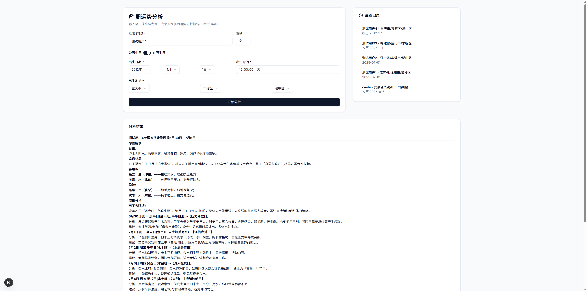

# 周运势 AI 分析

这是一个基于 AI 的周运势分析工具。特色：
1. 不同于通用运势分析，本工具根据当日的五行能量结合用户自身属性生成专属的分析报告；
2. 采用专业的天文历法库来精确计算时间信息，为大语言模型（LLM）构建精确、丰富的上下文，规避AI幻觉；
3. 纯私有化使用，降低数据隐私风险；
4. 分析精准，真太阳时自动校准。




## 先决条件

在开始之前，请确保开发环境中安装了以下软件：

-   [Python](https://www.python.org/downloads/) (版本 3.8 或更高)
-   [Node.js](https://nodejs.org/) (版本 18.0 或更高) 和 npm

## 安装与配置

1.  **克隆代码库**

    ```bash
    git clone <项目地址>
    cd zhoubazi
    ```

2.  **配置环境变量**

    项目需要一个 API 密钥来调用大语言模型。请在项目根目录下创建一个名为 `.env` 的文件，并添加以下内容：

    ```env
    DEEPSEEK_API_KEY="sk-your-deepseek-api-key"
    ```

    请将 `sk-your-deepseek-api-key` 替换为你自己的 DeepSeek API 密钥。

3.  **安装 Python 依赖**

    建议在一个虚拟环境中安装依赖，以避免包版本冲突。

    ```bash
    # 创建虚拟环境 (可选但推荐)
    python -m venv venv
    # 激活虚拟环境
    # Windows
    .\venv\Scripts\activate
    # macOS/Linux
    source venv/bin/activate

    # 安装依赖
    pip install -r requirements.txt
    ```

4.  **安装前端依赖**

    前端的依赖安装将由启动脚本自动处理，你也可以手动安装：

    ```bash
    cd app
    npm install
    cd ..
    ```

## 运行项目

我提供了一个方便的脚本来一键启动整个应用（包括前端和后端服务）。

在项目根目录下，运行以下命令：

```bash
python run.py
```

脚本将会：
1.  检查并安装前端依赖（如果 `app/node_modules` 目录不存在）。
2.  在 `http://127.0.0.1:8000` 启动 FastAPI 后端服务。
3.  在 `http://localhost:3000` 启动 Next.js 前端开发服务。

启动成功后，你可以在浏览器中打开 `http://localhost:3000` 来使用本应用。

## 停止项目

在运行 `python run.py` 的终端中，按下 `Ctrl+C` 即可关闭前端和后端两个服务。 

## 注意事项

1.  **免责声明：** 本项目的所有输出内容仅供娱乐和技术探讨，不构成任何形式的专业建议。请勿将分析结果作为您做出重要决策的依据。

2.  **数据隐私：** 您的个人信息（如生日、城市）仅用于构建API请求，历史记录保存在您的浏览器本地。但请注意，您的数据将会被发送至您自己配置的DeepSeek API服务。

3.  **内容准确性：** 命理分析本身并非精确科学，且AI模型的回答具有不确定性，因此分析结果可能存在偏差，请理性看待。


